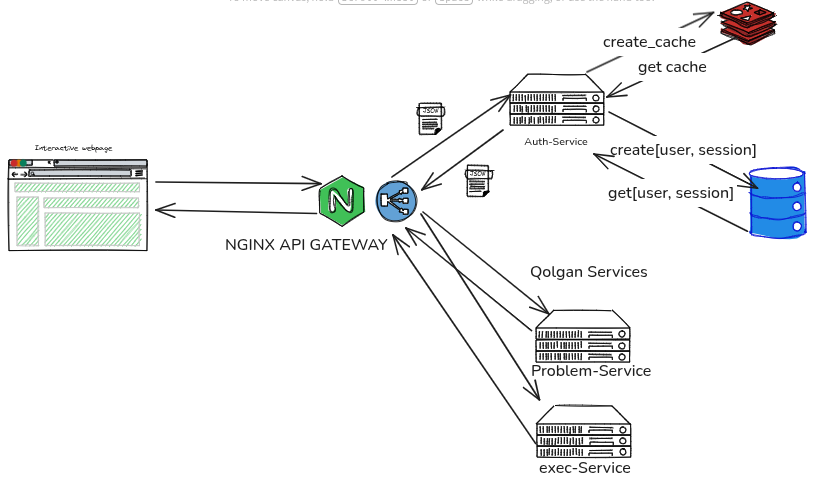

# Auth-Service


## Terminal orqali ishga tushirish

1. Virtual environment yaratish:
```bash
python3 -m venv  myenv
```
2. Virtual environmentni aktivlashtirish (Linux):
```bash
source myenv/bin/activate
```
3. Serverni ishga tushirish:
```bash
python3 bot/main.py
```

## Docker bilan ishlatish

1. Docker image yaratish:

```bash
docker build -t my-auth-server .
```

2. Docker image-ni run qilish:
```bash
docker run -it --name my-auth-server-container -p 8080:8080 my-auth-server
```

.env file yarating
```bash
# Telegram bot token
TOKEN=83VQ5WyqeLgA0mxtZ4jai0

# JWT / Secret key
SECRET_KEY=a-sits-long
```
## --Bot uchin foydalaning--
```bash
❤️‍🔥 💸 💯 🔥 🐳 🍉 🚀 😎 🫡 🫠
🫶 🫰 🫢 🫣 🫡 🫨 🦄 🦊 🐼 🐧
🌌 🌃 🌠 🪐 🌈 🌊 🌋 🌴 🌵 🌻
🍔 🍟 🌭 🍕 🍫 🍩 🍭 🍹 🍷 🥂
🥳 🤩 😍 🥰 😂 🤯 🤬 🤡 👻 💀
🤖 👾 🎃 🐉 🦖 🐲 🦕 🐢 🐙 🦑
⚡️ 🌟 ✨ 💫 🎇 🎆 🪄 🎉 🎊 🎀
🏆 🎯 🎮 🎲 🎰 🎪 🎭 🎨 🎼 🎤
🎧 🎹 🥁 🎺 🎻 🎷 🪕 🛸 🚁 🚂
🚗 🏍 🚤 ✈️ 🚀 🚢 🛶 ⛵️ 🚲 🛴
```